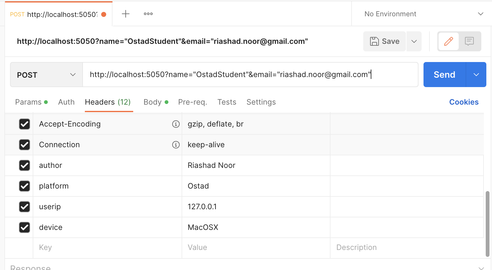
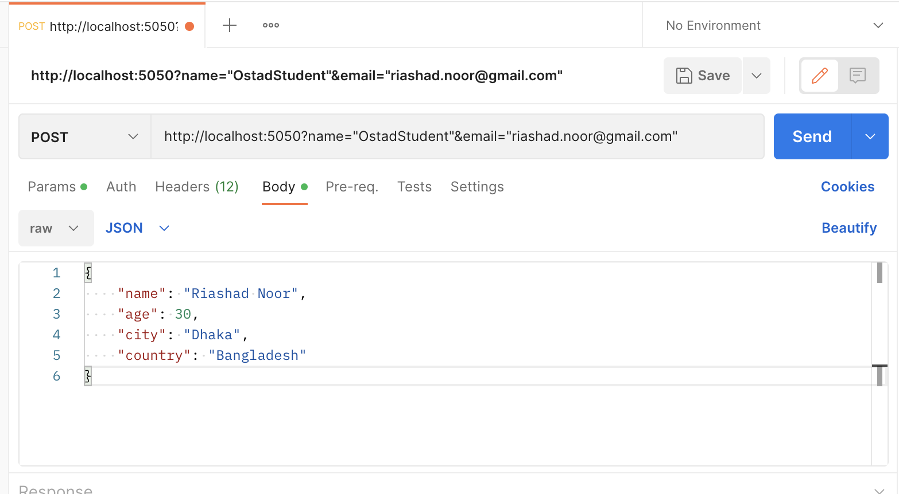
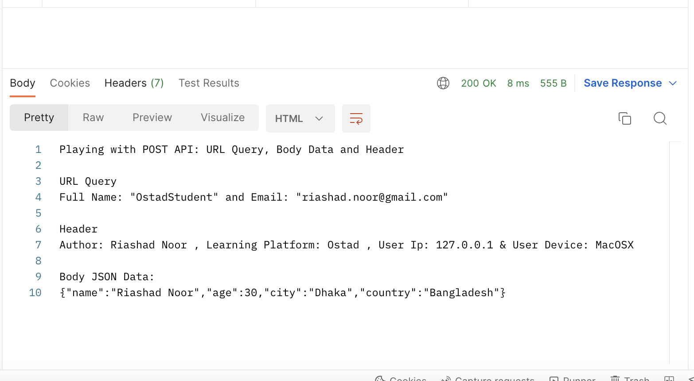
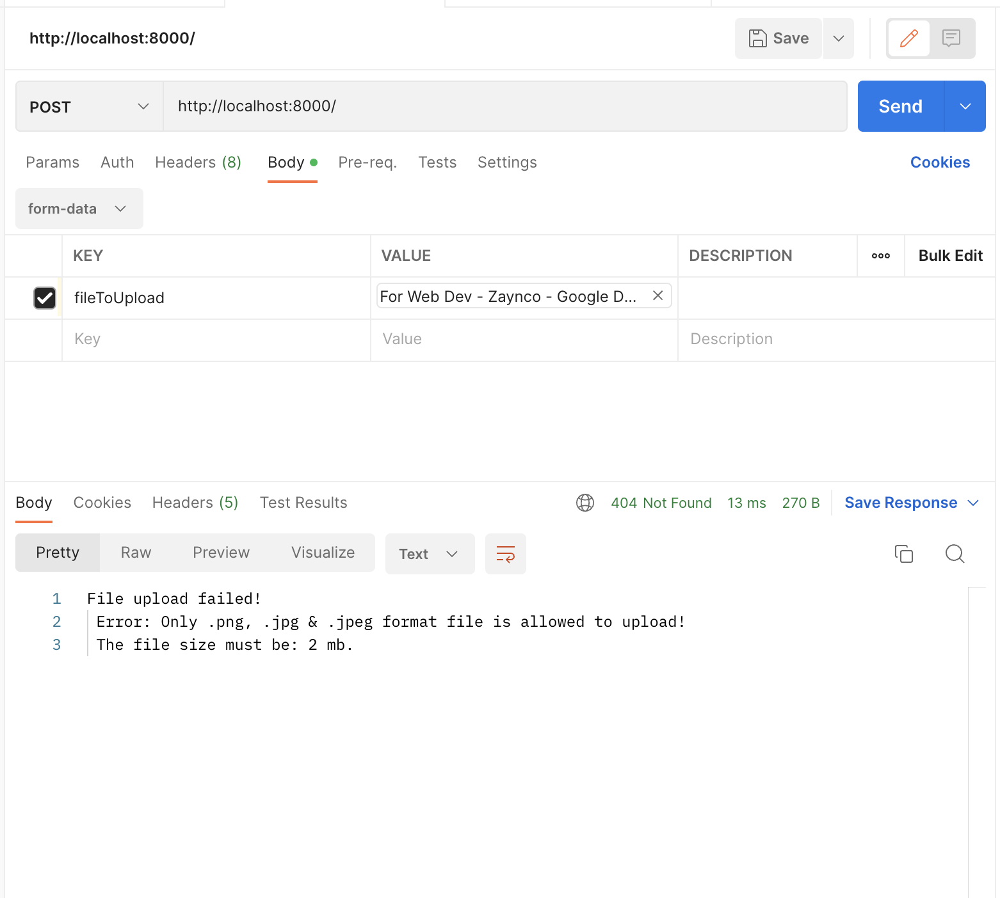
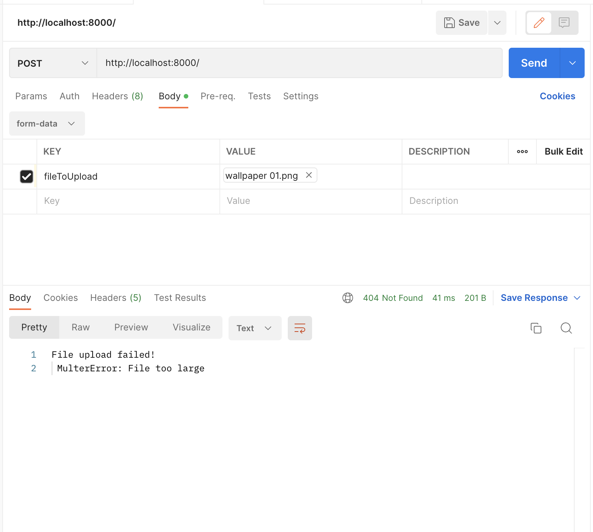
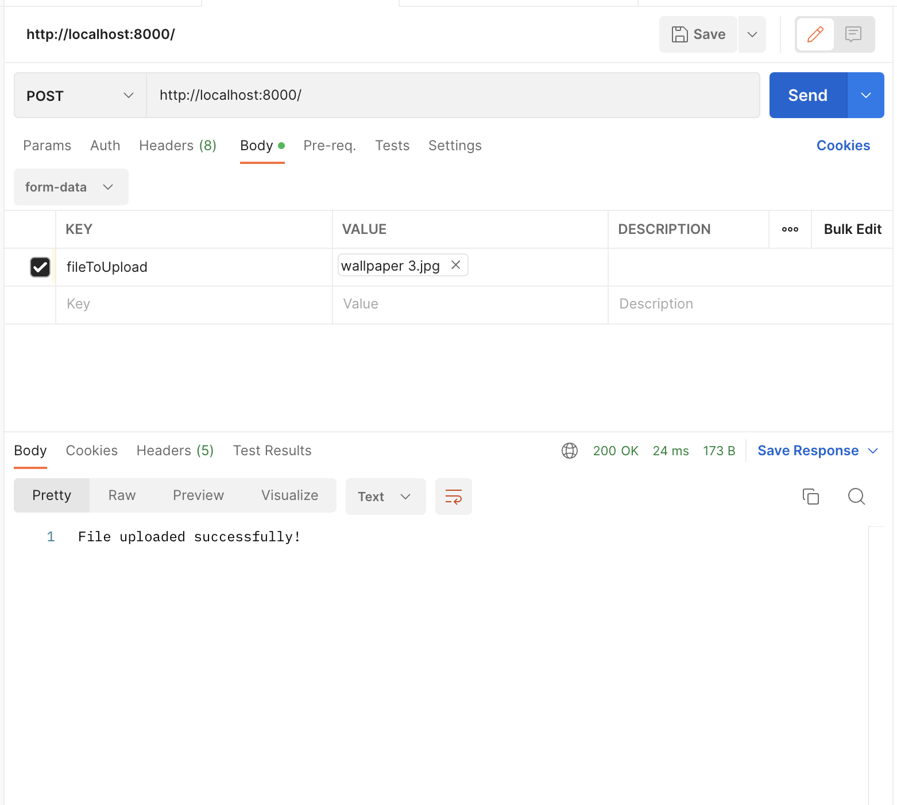
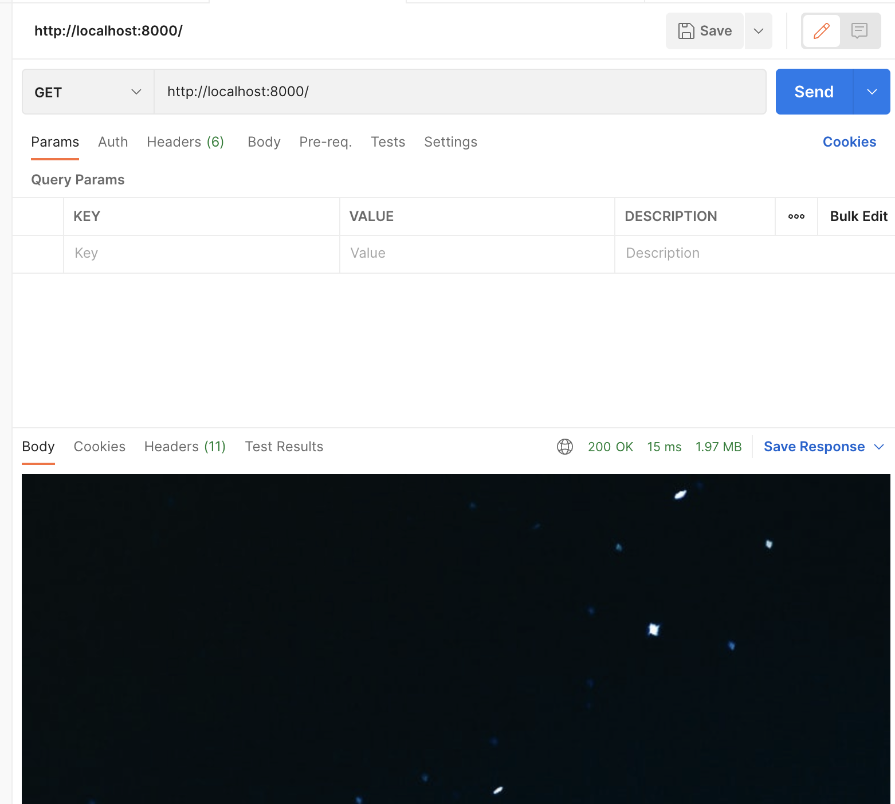

**Assignment Four: Express JS Fundamental**
---------------------------
**Assignment Tasks:**
1. Make a POST API with URL Query,Body & Header Properties. 
2. Make a file upload API support PNG,JPG file only.
3. Make a file Download API, that can download file from application directory.

**Outside Task**
1. Middleware practice
2. Route grouping
3. Upload filesize limiting
4. Cookies
5. Learning adding image in git (markdown)

**1. Post API**

**2. File Upload API**

**3. File Download API**
